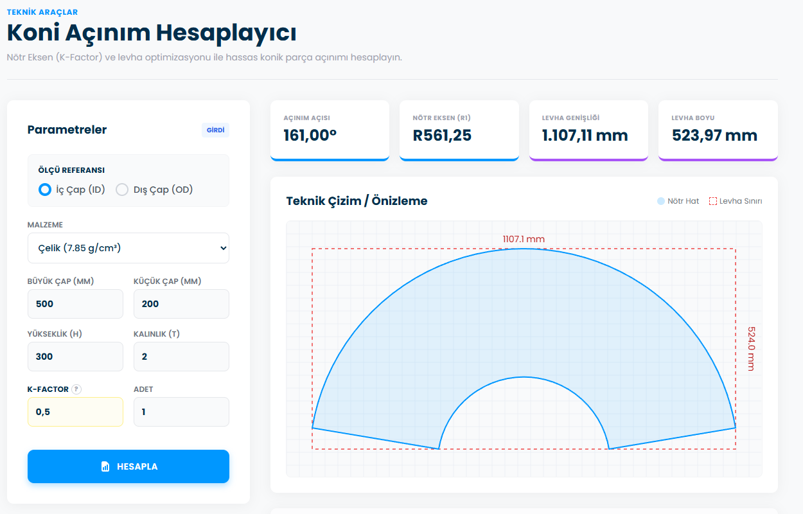
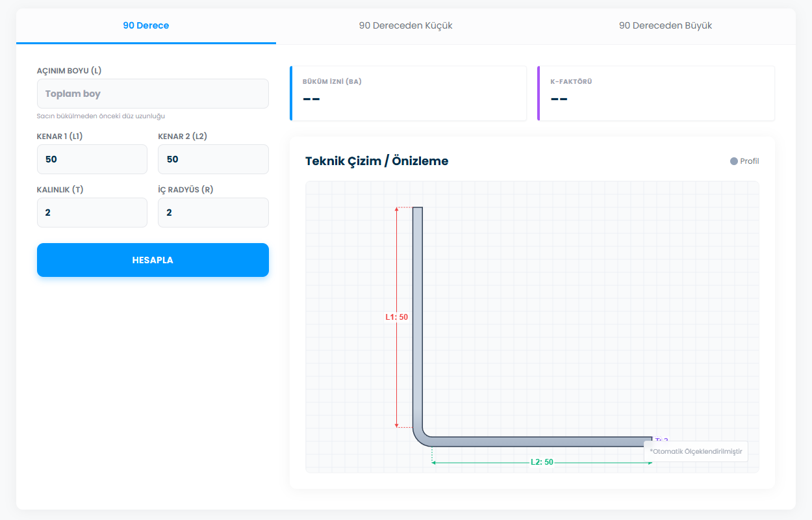
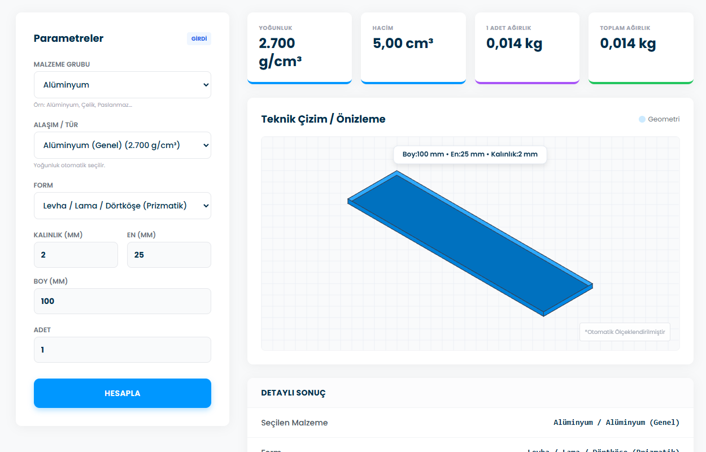

# Mühendislik Hesaplama Araçları | Üçüncü Binyıl

Bu proje, mühendislik ve imalat süreçlerinde sıkça ihtiyaç duyulan teknik hesaplamaları (Koni açınımı, K-Faktörü, Teorik ağırlık vb.) kolaylaştırmak amacıyla geliştirilmiş web tabanlı bir araç setidir.

## 🚀 Özellikler ve Ekran Görüntüleri

Proje içerisinde aşağıdaki hesaplama modülleri bulunmaktadır:

### 1. Koni Açınım Hesaplayıcı
Sac metal büküm işlemleri için nötr eksen (K-Factor) tabanlı hassas açınım hesabı yapar. İç çap veya dış çap referansına göre hesaplama yapabilir ve açınım şablonunu görselleştirir.



### 2. K-Faktör ve Büküm Hesaplayıcı
Sac açınım boyu ve malzeme testlerinden K-faktörünü ve büküm iznini (BA) hesaplar. Farklı büküm açıları (90°, <90°, >90°) için simülasyon sunar.



### 3. Teorik Ağırlık Hesaplayıcı
Farklı malzeme türleri (Çelik, Alüminyum, Paslanmaz vb.) ve formlar (Levha, Çubuk, Boru, Profil, Altıköşe) için ağırlık hesabı yapar. Malzeme kütüphanesi sayesinde yoğunlukları otomatik getirir.



### 4. Makro İndirme
SolidWorks veya diğer CAD programları için yardımcı makro dosyalarına (örn: Delik Makrosu) kolay erişim sağlar.

---

## 🛠️ Kullanılan Teknolojiler

*   **HTML5 & CSS3:** Semantik yapı ve stil.
*   **JavaScript (ES6+):** Hesaplama motoru ve dinamik DOM manipülasyonu.
*   **Tailwind CSS:** Modern ve responsive UI tasarımı.
*   **HTML5 Canvas:** Teknik çizimlerin ve açınımların dinamik olarak görselleştirilmesi.

## 📦 Kurulum ve Kullanım

Bu proje statik bir web sitesidir, herhangi bir sunucu kurulumu gerektirmez.

1.  Projeyi bilgisayarınıza indirin veya klonlayın.
2.  `index.html` dosyasına çift tıklayarak tarayıcınızda açın.
3.  Hesaplamak istediğiniz aracı menüden seçin.

## 📂 Klasör Yapısı

```
uby-calculator/
├── assets/          # Statik dosyalar
│   ├── img/         # Görseller ve logolar
│   └── files/       # İndirilebilir makro dosyaları
├── index.html       # Ana sayfa
├── koni.html        # Koni hesaplama aracı
├── kfactor.html     # K-Faktör hesaplama aracı
├── agirlik.html     # Ağırlık hesaplama aracı
├── makro-indir.html # Dosya indirme sayfası
└── README.md        # Proje dokümantasyonu
```

## 📝 Lisans

Bu proje **Üçüncü Binyıl Akademi** eğitim amaçlı çalışmaları kapsamında geliştirilmiştir.
